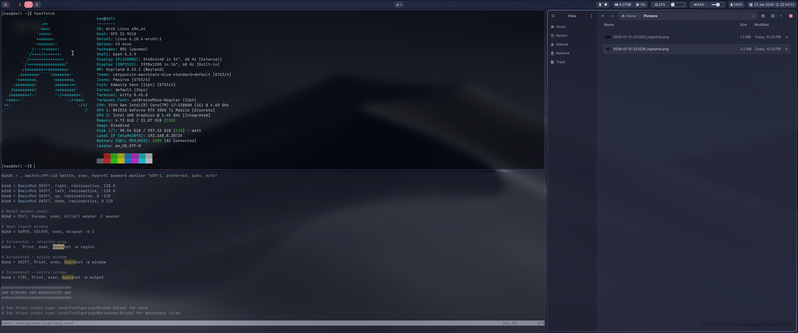

# dotfiles

My oonfigs for Arch + Hyprland. Based heavily on [Catppuccin](https://catppuccin.com/palette/) color palette.


## Screenshot




## Usage

The simplest way is to use [GNU stow](https://www.gnu.org/software/stow/): 

```bash
stow hypr waybar rofi kitty # ... and other configs you need
```
For sddm, you have to copy contents manually (symlinks doesn't work, unfortunately).  

You can also copy contents of each config manually. 
